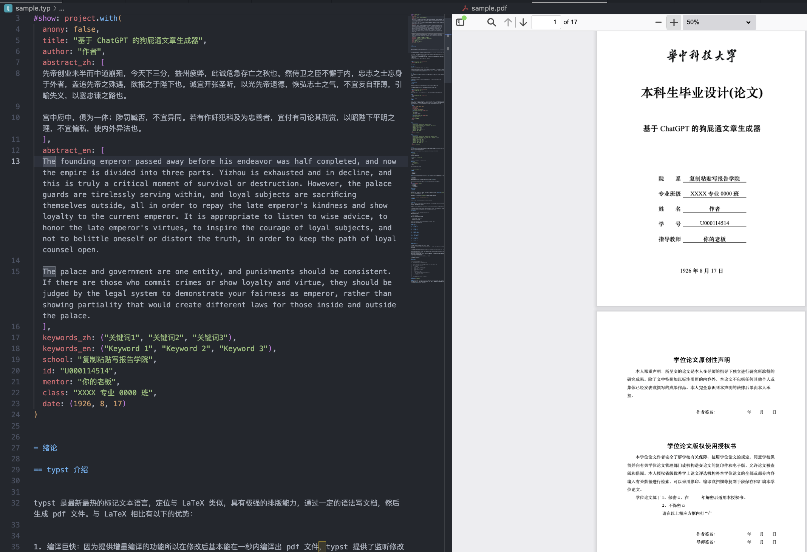
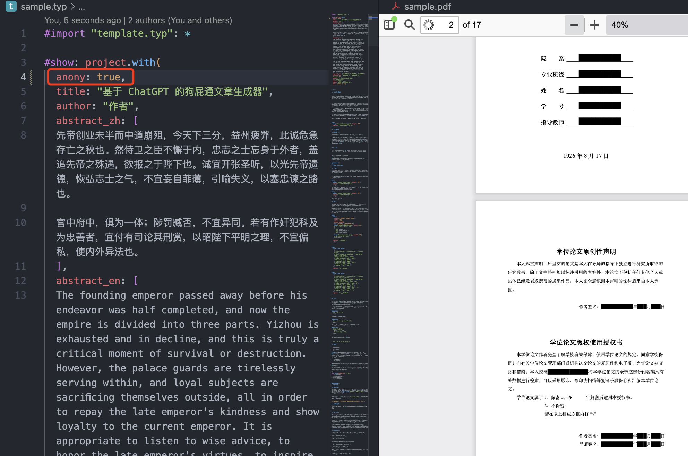

# HUST-typst-template

用于华科毕业设计（本科）的 typst 模板，一键、快速、持续生成毕业论文 pdf。

## ⚠️风险警告⚠️

- 民间模板，存在不被认可风险
  - 作者用此模板已成功从网安学院毕业
- 有部分难以短期解决的问题：
  - 无伪粗体：暂时无法解决，但是标题所需的黑体粗体在打印出来的情况下几乎看不出区别

## 什么是 typst

[typst](https://github.com/typst/typst) 是最新最热的标记文本语言，定位与 LaTeX 类似，具有极强的排版能力，通过一定的语法写文档，然后生成 pdf 文件。与 LaTeX 相比有以下的优势：

1. 编译巨快：因为提供增量编译的功能所以在修改后基本能在一秒内编译出 pdf 文件，typst 提供了监听修改自动编译的功能，可以像 Markdown 一样边写边看效果。
2. 环境搭建简单：原生支持中日韩等非拉丁语言，不用再大量折腾字符兼容问题以及下载好几个 G 的环境。只需要下载命令行程序就能开始编译生成 pdf。
3. 语法友好：对于普通的排版需求，上手难度跟 Markdown 相当，同时文本源码阅读性高：不会再充斥一堆反斜杠跟花括号

个人观点：跟 Markdown 一样好用，跟 LaTeX 一样强大

可以从[这里速通 typst](https://typst.app/docs/tutorial)

跟 word 比的优势：格式好调，玄学问题少。

## 使用

快速浏览效果：[查看sample.pdf](./sample.pdf)，样例论文源码：[查看sample.typ](./sample.typ)

### 本地编辑（推荐）

1. 下载对应平台的 typst：https://github.com/typst/typst/releases 记得先看看它的 README
2. clone 本仓库
3. 按本仓库中的 sample.typ 照葫芦画瓢即可，sample.typ 既是样例也是说明书
4. 在本项目目录里，命令行执行 `typst watch xxx.typ` 的命令即可编译同名 pdf 文件，而且一旦更新就会增量编译，推荐在 VSCode 中编辑，下载 `Typst LSP` 插件获得语法提示，使用 [`Typst Preview`](https://github.com/enter-tainer/typst-preview-vscode) 插件可以实现文本和预览之间的快速跳转与实时预览。

### 线上编辑（不推荐）

typst 也提供了线上编辑器（类似overleaf），查看本模板：
https://typst.app/project/rqTPs502DAhLTQctaUmbtn

（ps：浏览器可能没有微软宋体、微软黑体等学校要求的字体，不建议在该平台上生成）

## 其他特性

* 支持匿名处理，anonymous 参数设置为 true 即为匿名，会把校名以及个人信息等替换成小黑条，论文提交阶段使用，不需要再对 pdf 作特殊编辑（致谢中的敏感信息仍需自己处理）

## 说明

该模板仍需完善，有一定肉眼排版成分，所以有可能不完全符合华科排版要求，如果遇到不对的间距、字体等请提交 issue 说明，也欢迎 pull request 贡献。

不同学院的模版不太一致，因此在原网安学院的模版上稍加修改得到了计算机学院的模版，如果使用**计算机学院**的模版，请在 `sample.typ` 中选择导入`cs-template.typ` 

**Help Wanted** 笔者已毕业跑路，无法勤快维护，希望能有对本项目有兴趣的人参与，可做的事情还有很多:)

### TODO
[ ] 模板翻新（基本在 Typst 0.6.0 前成型，有部分人工造轮子成分）

[ ] 支持 HUST 硕士、博士论文甚至作业报告模板

[ ] template.typ 模块化

## 开发指南
### 内部目录
* `fonts` 目录: 定义字体集
* `pages` 目录: 包含了模板用到的各个**独立页面**，例如封面页、声明页、摘要等。
* `utilities` 目录: 包含了包含了模板使用到的各种自定义辅助函数。
* `variable` 目录: 包含了创建模板变种（原始模板以 CSE 格式为基础）所需的辅助函数
* `xxx-template.typ` 模板及其变种

## 参考及致谢

* https://github.com/zfengg/HUSTtex HUSTTex 项目
* https://www.overleaf.com/read/fdbtqrqrqgfg 计院模板
* https://github.com/nju-lug/nju-thesis-typst NJU 模板，文档相对完善，对中文 Typst 模板有疑问可以查询
* https://github.com/redleafnew/Chinese-STD-GB-T-7714-related-csl/blob/main/462huazhong-university-of-science-and-technology-school-of-cyber-science-and-engineering.csl 华科网安版本 CSL，稍加改写以通过 Rust 的 quick-xml 库编译